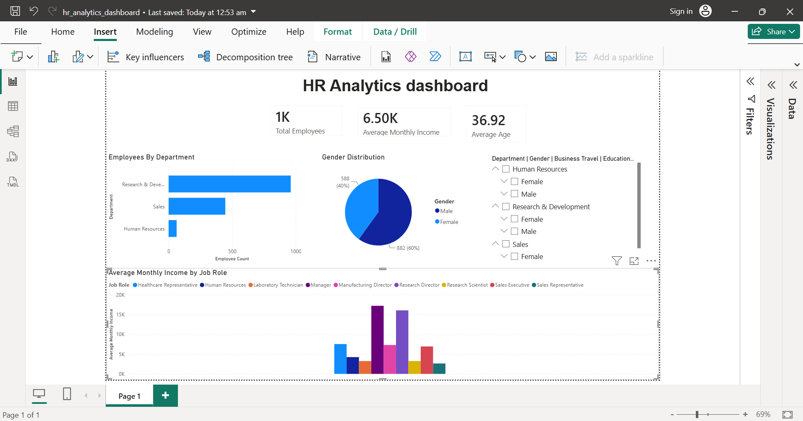

# HR-Analytics-Dashboard
Interactive HR Analytics Dashboard built using Power BI and MySQL.
# HR Analytics Dashboard

## Overview

This project is an interactive HR Analytics Dashboard built using Power BI and MySQL.

The dashboard analyzes employee data to understand workforce distribution, salary trends, and employee attrition.

---

## Tools Used

- Power BI
- MySQL
- DAX

---

## Dataset

IBM HR Analytics Employee Attrition & Performance Dataset

source: kaggle

---

## Dashboard Preview

## Features

- Total Employee KPI
- Average Monthly Income
- Average Age
- Department-wise Employee Distribution
- Attrition by Department
- Average Salary by Job Role
- Interactive Slicers

---

Key Insights

• Research & Development has the largest workforce.

• Sales experiences higher employee attrition.

• Monthly income differs significantly across job roles.

• Dashboard filters allow analysis by department, gender, business travel, and education field.

---

## Files

- HR_Analytics_Dashboard.pbix
- hr_analytics.sql
- dashboard.png
- project1sqlscript.sql

---

## Project Summary

Built an interactive HR Analytics dashboard using MySQL and Power BI to analyze employee attrition, salary distribution, workforce demographics, and departmental trends. The dashboard includes interactive filters and KPIs to support business decision making.

---
